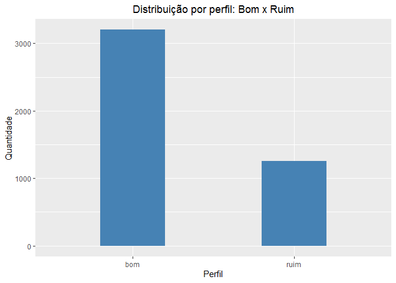

-----

output: github\_document

-----

# Titulo

# Objetivo

``` r
library(tidyverse)
```

    ## Warning: replacing previous import 'vctrs::data_frame' by 'tibble::data_frame'
    ## when loading 'dplyr'

    ## -- Attaching packages ------------------------- tidyverse 1.3.0 --

    ## v ggplot2 3.3.2     v purrr   0.3.4
    ## v tibble  3.0.3     v dplyr   1.0.1
    ## v tidyr   1.1.1     v stringr 1.4.0
    ## v readr   1.3.1     v forcats 0.5.0

    ## -- Conflicts ---------------------------- tidyverse_conflicts() --
    ## x dplyr::filter() masks stats::filter()
    ## x dplyr::lag()    masks stats::lag()

``` r
df_credito <- read_rds("data/credito.rds")
df_credito_ajustado <- df_credito%>%
  tidyr::replace_na(replace = list(moradia = "indefinido",
                                   estado_civil = "indefinido",
                                   trabalho = "indefinido"))

df_credito_ajustado <- df_credito_ajustado %>%
  tidyr::replace_na(replace = list(renda = mean(df_credito_ajustado$renda, na.rm = TRUE),
                                   ativos = mean(df_credito_ajustado$ativos, na.rm = TRUE),
                                    dividas = mean(df_credito_ajustado$dividas, na.rm = TRUE)))
df_credito_ajustado <- df_credito_ajustado %>%
  mutate(faixa_etária = case_when(idade<=25 ~ "(Abaixo dos 25 anos)",
                                  idade<=35 ~ "(Entre 26 e 35 anos",
                                  idade<=45 ~ "Entre 36 e 45 anos",
                                  idade<=55 ~ "Entre 46 e 55 anos",
                                  idade<85 ~"Acima dos 55 anos")) %>%
  relocate(faixa_etária, .after = idade)
```

Objetivo

``` r
ggplot()+
  aes(x = df_credito_ajustado$status)+
  geom_bar(width = 0.4, fill = "#4682B4")+
  labs( title = "Distribuição por perfil: Bom x Ruim",
        x = "Perfil",
        y = "Quantidade")+
  theme_gray()+
  theme(
    legend.position = "right",
    plot.title = element_text(
      hjust = 0.5
    )
  )
```

<!-- -->

Add a new chunk by clicking the *Insert Chunk* button on the toolbar or
by pressing *Ctrl+Alt+I*.

When you save the notebook, an HTML file containing the code and output
will be saved alongside it (click the *Preview* button or press
*Ctrl+Shift+K* to preview the HTML file).

The preview shows you a rendered HTML copy of the contents of the
editor. Consequently, unlike *Knit*, *Preview* does not run any R code
chunks. Instead, the output of the chunk when it was last run in the
editor is displayed.
