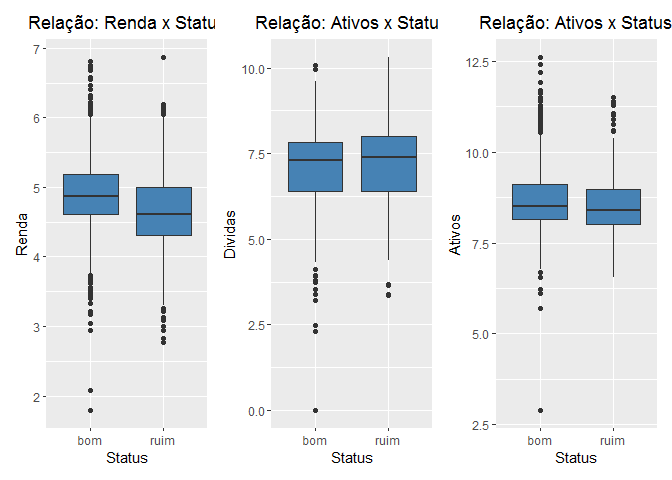

# Análise de Perfil: Concessão de Crédito

# Objetivo

  - Demonstrar algumas técnicas de AED;
  - Apresentar as caracteristicas demograficas e financeiras dos
    clientes presentes na base de dados;
  - Identificar quais variáveis do modelo explicam quais são os clientes
    bons e ruins;
  - Elaborar um modelo de previsão para o problema de negócio.

<!-- end list -->

``` r
library(tidyverse)
library(tidyr)
library(patchwork)
devtools::load_all()
```

Leitura do data.frame e visualização das variáveis

``` r
df_credito <- read_rds("data/credito.rds")
glimpse(df_credito)
```

    ## Rows: 4,454
    ## Columns: 14
    ## $ status           <chr> "bom", "bom", "ruim", "bom", "bom", "bom", "bom", ...
    ## $ tempo_empresa    <int> 9, 17, 10, 0, 0, 1, 29, 9, 0, 0, 6, 7, 8, 19, 0, 0...
    ## $ moradia          <chr> "alugada", "alugada", "própria", "alugada", "aluga...
    ## $ tempo_emprestimo <int> 60, 60, 36, 60, 36, 60, 60, 12, 60, 48, 48, 36, 60...
    ## $ idade            <int> 30, 58, 46, 24, 26, 36, 44, 27, 32, 41, 34, 29, 30...
    ## $ estado_civil     <chr> "casada(o)", "viúva(o)", "casada(o)", "solteira(o)...
    ## $ registros        <chr> "não", "não", "sim", "não", "não", "não", "não", "...
    ## $ trabalho         <chr> "autônomo", "fixo", "autônomo", "fixo", "fixo", "f...
    ## $ despesas         <int> 73, 48, 90, 63, 46, 75, 75, 35, 90, 90, 60, 60, 75...
    ## $ renda            <int> 129, 131, 200, 182, 107, 214, 125, 80, 107, 80, 12...
    ## $ ativos           <int> 0, 0, 3000, 2500, 0, 3500, 10000, 0, 15000, 0, 400...
    ## $ dividas          <int> 0, 0, 0, 0, 0, 0, 0, 0, 0, 0, 0, 0, 2500, 260, 0, ...
    ## $ valor_emprestimo <int> 800, 1000, 2000, 900, 310, 650, 1600, 200, 1200, 1...
    ## $ preco_do_bem     <int> 846, 1658, 2985, 1325, 910, 1645, 1800, 1093, 1957...

Contagem dos valores NAs por váriavel do modelo

    ## [1] "moradia"
    ## [1] 26
    ## [1] "estado_civil"
    ## [1] 1
    ## [1] "trabalho"
    ## [1] 2
    ## [1] "renda"
    ## [1] 381
    ## [1] "ativos"
    ## [1] 47
    ## [1] "dividas"
    ## [1] 18

\#Avaliação para substituição dos NA’s

``` r
#As variáveis moradia, estado_civil e trabalho, apresentaram um número de NA's pouco expressivo, foi considerado como ERRO no cadastro. Para esse estudo não foi feita análise, mas sim a alteração dos campos NA's para indefinido.

df_credito_ajustado <- df_credito%>%
  tidyr::replace_na(replace = list(moradia = "indefinido",
                                   estado_civil = "indefinido",
                                   trabalho = "indefinido"))

#As variáveis renda, ativos e dívidas, foram objeto de análise, gráfica e estatística, conforme abaixo:

grafico_rel_renda <- df_credito_ajustado %>%
  filter(!is.na(renda)) %>%
  ggplot() +
  aes(x = status, y = log(renda)) +
  geom_boxplot(fill = "#4682B4")+
  labs( title = "Relação: Renda x Status",
        x = "Status",
        y = "Renda")+
  theme_gray()+
  theme(
    legend.position = "right",
    plot.title = element_text(
      hjust = 0.5
    )
  )


grafico_rel_ativos <- df_credito_ajustado %>%
  filter(!is.na(ativos)) %>%
  ggplot() +
  aes(x = status, y = log(ativos)) +
  geom_boxplot(fill = "#4682B4")+
  labs( title = "Relação: Ativos x Status",
        x = "Status",
        y = "Ativos")+
  theme_gray()+
  theme(
    legend.position = "right",
    plot.title = element_text(
      hjust = 0.5
    )
  )

grafico_rel_dividas <- df_credito_ajustado %>%
  filter(!is.na(dividas)) %>%
  ggplot() +
  aes(x = status, y = log(dividas)) +
  geom_boxplot(fill = "#4682B4")+
  labs( title = "Relação: Ativos x Status",
        x = "Status",
        y = "Dividas")+
  theme_gray()+
  theme(
    legend.position = "right",
    plot.title = element_text(
      hjust = 0.5
    )
  )

patchwork::wrap_plots(grafico_rel_renda + grafico_rel_dividas + grafico_rel_ativos) 
```

<!-- -->

Retirada dos NA’s

``` r
  df_credito_ajustado <- df_credito%>%
  replace_na(replace = list(moradia = "indefinido",
                                   estado_civil = "indefinido",
                                   trabalho = "indefinido"))

  df_credito_ajustado <- df_credito_ajustado %>%
  replace_na(replace = list(renda = mean(df_credito_ajustado$renda, na.rm = TRUE),
                                   ativos = mean(df_credito_ajustado$ativos, na.rm = TRUE),
                                    dividas = mean(df_credito_ajustado$dividas, na.rm = TRUE)))
df_credito_ajustado <- df_credito_ajustado %>%
  mutate(faixa_etária = case_when(idade<=25 ~ "(Abaixo dos 25 anos)",
                                  idade<=35 ~ "(Entre 26 e 35 anos",
                                  idade<=45 ~ "Entre 36 e 45 anos",
                                  idade<=55 ~ "Entre 46 e 55 anos",
                                  idade<85 ~"Acima dos 55 anos")) %>%
  relocate(faixa_etária, .after = idade)
```
