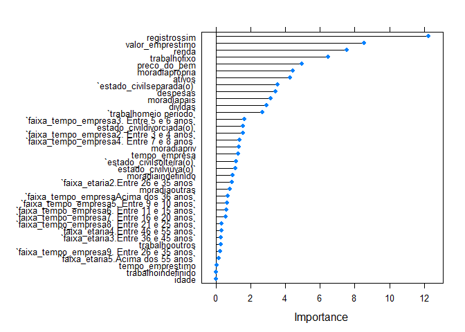

# Análise de Perfil: Concessão de Crédito

## Objetivo

  - Demonstrar algumas técnicas de AED;
  - Apresentar as caracteristicas demograficas e financeiras dos
    clientes presentes na base de dados;
  - Identificar quais variáveis do modelo explicam quais são os clientes
    bons e ruins;
  - Elaborar um modelo de previsão para o problema de negócio.

## Pacotes utilizados

``` r
library(tidyverse)
library(tidyr)
library(patchwork)
library(caret)
library(randomForest)
library(ROCR)
devtools::load_all()
```

**Etapa 1: Análise Exploratória dos Dados**

**Leitura do data.frame e visualização das variáveis**

``` r
df_credito <- read_rds("data/credito.rds")
glimpse(df_credito)
```

    ## Rows: 4,454
    ## Columns: 14
    ## $ status           <chr> "bom", "bom", "ruim", "bom", "bom", "bom", "bom", ...
    ## $ tempo_empresa    <int> 9, 17, 10, 0, 0, 1, 29, 9, 0, 0, 6, 7, 8, 19, 0, 0...
    ## $ moradia          <chr> "alugada", "alugada", "própria", "alugada", "aluga...
    ## $ tempo_emprestimo <int> 60, 60, 36, 60, 36, 60, 60, 12, 60, 48, 48, 36, 60...
    ## $ idade            <int> 30, 58, 46, 24, 26, 36, 44, 27, 32, 41, 34, 29, 30...
    ## $ estado_civil     <chr> "casada(o)", "viúva(o)", "casada(o)", "solteira(o)...
    ## $ registros        <chr> "não", "não", "sim", "não", "não", "não", "não", "...
    ## $ trabalho         <chr> "autônomo", "fixo", "autônomo", "fixo", "fixo", "f...
    ## $ despesas         <int> 73, 48, 90, 63, 46, 75, 75, 35, 90, 90, 60, 60, 75...
    ## $ renda            <int> 129, 131, 200, 182, 107, 214, 125, 80, 107, 80, 12...
    ## $ ativos           <int> 0, 0, 3000, 2500, 0, 3500, 10000, 0, 15000, 0, 400...
    ## $ dividas          <int> 0, 0, 0, 0, 0, 0, 0, 0, 0, 0, 0, 0, 2500, 260, 0, ...
    ## $ valor_emprestimo <int> 800, 1000, 2000, 900, 310, 650, 1600, 200, 1200, 1...
    ## $ preco_do_bem     <int> 846, 1658, 2985, 1325, 910, 1645, 1800, 1093, 1957...

**Contagem dos valores NAs por váriavel do modelo**

    ## [1] "moradia"
    ## [1] 26
    ## [1] "estado_civil"
    ## [1] 1
    ## [1] "trabalho"
    ## [1] 2
    ## [1] "renda"
    ## [1] 381
    ## [1] "ativos"
    ## [1] 47
    ## [1] "dividas"
    ## [1] 18

**Avaliação para substituição dos NA’s**

**As variáveis moradia, estado\_civil e trabalho, apresentaram um número
de NA’s pouco expressivo, foi considerado como ERRO no cadastro. Para
esse estudo não foi feita análise, mas sim a alteração dos campos NA’s
para indefinido.**

``` r
df_credito_ajustado <- df_credito%>%
  tidyr::replace_na(replace = list(moradia = "indefinido",
                                   estado_civil = "indefinido",
                                   trabalho = "indefinido"))
```

**As variáveis renda, ativos e dívidas, foram objeto de análise,
gráfica, conforme abaixo:**

``` r
grafico_rel_renda + grafico_rel_dividas + grafico_rel_ativos 
```

<!-- -->

**Retirada dos NA’s**

**A análise visual dos dados, nos mostra que para ambas variáveis o
comportamento para o status, “Bom” ou “Ruim” apresenta a média muito
próxima, concluindo assim que não apresentam forte valor explicativo
para o modelo.**

**Optei pela retirada dos NA’s e inclusão da média para variável.**

``` r
  df_credito_ajustado <- df_credito_ajustado %>%
  replace_na(replace = list(renda = mean(df_credito_ajustado$renda, na.rm = TRUE),
                            ativos = mean(df_credito_ajustado$ativos, na.rm = TRUE),
                            dividas = mean(df_credito_ajustado$dividas, na.rm = TRUE)))
```

**Etapa 2: Caracteristicas demograficas e financeiras dos clientes
presentes na base de dados.**

**Na etapa inicial, foi realizada analise gráfica e o mapeamento de
algumas variáveis, conforme abaixo:**

``` r
dist_por_perfil + grafico_estado_civil + dist_por_faixa_eta
```

<!-- -->

**Por fim uma análise dentro das variáveis analisadas, buscando a
proporcão de bons pagadores de forma ampla**

``` r
prop.faixa.et
```

<!-- -->

``` r
prop.tempo.emp
```

<!-- -->

``` r
prop.est.civi 
```

<!-- -->

**Etapa 3: Elaborar modelo preditivo para o modelo**

**Ajustes nas Variáveis**

``` r
# Normalizando as variáveis

numeric.vars <- c("tempo_empresa", "tempo_emprestimo", "idade",
                  "despesas","renda","ativos","dividas", "valor_emprestimo","preco_do_bem")


df_credito_ajustado_previ <- scale.features(df_credito_ajustado_previ, numeric.vars)

#Variáveis tipo Fator
categorical.vars <- c('status_bin', 'faixa_tempo_empresa', 'faixa_etaria',
                      'estado_civil', 'trabalho', "moradia","registros")

df_credito_ajustado_previ <- to.factors(df = df_credito_ajustado_previ, variables = categorical.vars)


glimpse(df_credito_ajustado_previ)
```

    ## Rows: 4,453
    ## Columns: 16
    ## $ status_bin          <fct> 1, 1, 0, 1, 1, 1, 1, 1, 1, 0, 1, 1, 1, 1, 0, 1,...
    ## $ tempo_empresa       <dbl[,1]> <matrix[26 x 1]>
    ## $ faixa_tempo_empresa <fct> 5. Entre 9 e 10 anos, 7. Entre 16 e 20 anos, 5....
    ## $ moradia             <fct> alugada, alugada, própria, alugada, alugada, pr...
    ## $ tempo_emprestimo    <dbl[,1]> <matrix[26 x 1]>
    ## $ idade               <dbl[,1]> <matrix[26 x 1]>
    ## $ faixa_etaria        <fct> 2.Entre 26 e 35 anos, 5.Acima dos 55 anos, 4.En...
    ## $ estado_civil        <fct> casada(o), viúva(o), casada(o), solteira(o), so...
    ## $ registros           <fct> não, não, sim, não, não, não, não, não, não, nã...
    ## $ trabalho            <fct> autônomo, fixo, autônomo, fixo, fixo, fixo, fix...
    ## $ despesas            <dbl[,1]> <matrix[26 x 1]>
    ## $ renda               <dbl[,1]> <matrix[26 x 1]>
    ## $ ativos              <dbl[,1]> <matrix[26 x 1]>
    ## $ dividas             <dbl[,1]> <matrix[26 x 1]>
    ## $ valor_emprestimo    <dbl[,1]> <matrix[26 x 1]>
    ## $ preco_do_bem        <dbl[,1]> <matrix[26 x 1]>

**Divisão do data.frame em treino e teste**

``` r
# Dividindo os dados em treino e teste - 60:40
indexes <- sample(1:nrow(df_credito_ajustado_previ), size = 0.6 * nrow(df_credito_ajustado_previ))
train.data <- df_credito_ajustado_previ[indexes,]
test.data <- df_credito_ajustado_previ[-indexes,]
```

**Avaliando as variáveis que mais explicam o modelo**

``` r
rfe.results <- run.feature.selection(feature.vars = train.data[,-1],
                                 class.var = train.data[,1])

#Visualizando os resultados
rfe.results
```

    ## 
    ## Recursive feature selection
    ## 
    ## Outer resampling method: Cross-Validated (20 fold) 
    ## 
    ## Resampling performance over subset size:
    ## 
    ##  Variables Accuracy  Kappa AccuracySD KappaSD Selected
    ##          1   0.7391 0.2651    0.03574 0.10480         
    ##          2   0.7492 0.3605    0.03613 0.08886         
    ##          3   0.7698 0.3628    0.03097 0.08534         
    ##          4   0.7540 0.3439    0.03420 0.09304         
    ##          5   0.7563 0.3466    0.03035 0.08903         
    ##          6   0.7716 0.3856    0.03206 0.09310         
    ##          7   0.7716 0.3858    0.02859 0.08205         
    ##          8   0.7806 0.4037    0.03591 0.10070         
    ##          9   0.7776 0.4026    0.03924 0.11141         
    ##         10   0.7836 0.4168    0.04026 0.11211         
    ##         15   0.7915 0.4231    0.03225 0.09583        *
    ## 
    ## The top 5 variables (out of 15):
    ##    registros, trabalho, tempo_empresa, renda, valor_emprestimo

``` r
varImp((rfe.results))
```

    ##                       Overall
    ## registros           32.107797
    ## trabalho            24.707511
    ## tempo_empresa       19.089927
    ## renda               17.938109
    ## valor_emprestimo    16.138166
    ## ativos              14.246823
    ## faixa_tempo_empresa 12.371178
    ## moradia             11.818348
    ## despesas             8.658376
    ## tempo_emprestimo     7.774263
    ## idade                6.633562
    ## preco_do_bem         5.483701
    ## faixa_etaria         4.432108
    ## dividas              2.131132
    ## estado_civil         1.955963

**As variáveis que apresentaram maior relação explicativa a relação bom
ou mau pagador (conforme esse modelo) são:**

**registros 30.047797**

**trabalho 26.646050**

**tempo\_empresa 19.280090**

**renda 19.067687**

**valor-emprestimo 17.874087**

**Na análise descritiva realizada no início do estudo foram avaliadas
faixa etária, tempo de trabalho na empresa e estado civil. Nota-se, que
somente o tempo de empresa dentre as variáveis, consta na lista das 5
mais explicativas.**

``` r
## Separando as variáveis
test.feature.vars <- test.data[,-1]
test.class.var <- test.data[,1]

# Construindo um modelo de regressão logística
formula.init <- "status_bin ~ ."
formula.init <- as.formula(formula.init)
lr.model <- glm(formula = formula.init, data = train.data, family = "binomial")

# Visualizando o modelo
summary(lr.model)
```

    ## 
    ## Call:
    ## glm(formula = formula.init, family = "binomial", data = train.data)
    ## 
    ## Deviance Residuals: 
    ##     Min       1Q   Median       3Q      Max  
    ## -2.9905  -0.5830   0.3716   0.6754   2.5500  
    ## 
    ## Coefficients:
    ##                                            Estimate Std. Error z value Pr(>|z|)
    ## (Intercept)                                 1.22181    0.52429   2.330 0.019785
    ## tempo_empresa                               1.27805    0.47130   2.712 0.006693
    ## faixa_tempo_empresa2. Entre 3 e 4 anos     -0.02934    0.21195  -0.138 0.889909
    ## faixa_tempo_empresa3. Entre 5 e 6 anos     -0.08858    0.30857  -0.287 0.774072
    ## faixa_tempo_empresa4. Entre 7 e 8 anos     -0.07861    0.44500  -0.177 0.859784
    ## faixa_tempo_empresa5. Entre 9 e 10 anos    -0.19545    0.55730  -0.351 0.725808
    ## faixa_tempo_empresa6. Entre 11 e 15 anos   -0.64334    0.72280  -0.890 0.373429
    ## faixa_tempo_empresa7. Entre 16 e 20 anos   -0.85167    1.02602  -0.830 0.406500
    ## faixa_tempo_empresa8. Entre 21 e 25 anos   -1.48725    1.32654  -1.121 0.262226
    ## faixa_tempo_empresa9. Entre 26 e 35 anos   -2.84919    1.67902  -1.697 0.089708
    ## faixa_tempo_empresaAcima dos 36 anos        8.47702  288.45384   0.029 0.976555
    ## moradiaindefinido                          -0.28698    0.67099  -0.428 0.668868
    ## moradiaoutras                              -0.27104    0.21644  -1.252 0.210485
    ## moradiapais                                 0.56886    0.17861   3.185 0.001447
    ## moradiapriv                                 0.11667    0.24567   0.475 0.634838
    ## moradiaprópria                              0.71893    0.14624   4.916 8.83e-07
    ## tempo_emprestimo                           -0.02782    0.06726  -0.414 0.679186
    ## idade                                       0.03022    0.22299   0.136 0.892210
    ## faixa_etaria2.Entre 26 e 35 anos            0.31757    0.21613   1.469 0.141733
    ## faixa_etaria3.Entre 36 e 45 anos           -0.12560    0.37852  -0.332 0.740017
    ## faixa_etaria4.Entre 46 e 55 anos           -0.11397    0.57323  -0.199 0.842408
    ## faixa_etaria5.Acima dos 55 anos            -0.33620    0.78442  -0.429 0.668220
    ## estado_civildivorciada(o)                  -0.53612    0.57824  -0.927 0.353845
    ## estado_civilseparada(o)                    -0.87594    0.29744  -2.945 0.003230
    ## estado_civilsolteira(o)                    -0.24247    0.16994  -1.427 0.153630
    ## estado_civilviúva(o)                       -0.15629    0.45023  -0.347 0.728486
    ## registrossim                               -1.82390    0.13456 -13.554  < 2e-16
    ## trabalhofixo                                0.85113    0.13431   6.337 2.34e-10
    ## trabalhoindefinido                        -14.62958 1455.39770  -0.010 0.991980
    ## trabalhomeio período                       -0.58480    0.18720  -3.124 0.001785
    ## trabalhooutros                              0.15803    0.26790   0.590 0.555274
    ## despesas                                   -0.26317    0.06802  -3.869 0.000109
    ## renda                                       0.51393    0.06928   7.418 1.19e-13
    ## ativos                                      0.36987    0.09926   3.726 0.000194
    ## dividas                                    -0.22206    0.05457  -4.069 4.72e-05
    ## valor_emprestimo                           -0.83850    0.10724  -7.819 5.32e-15
    ## preco_do_bem                                0.46350    0.10395   4.459 8.23e-06
    ##                                             
    ## (Intercept)                              *  
    ## tempo_empresa                            ** 
    ## faixa_tempo_empresa2. Entre 3 e 4 anos      
    ## faixa_tempo_empresa3. Entre 5 e 6 anos      
    ## faixa_tempo_empresa4. Entre 7 e 8 anos      
    ## faixa_tempo_empresa5. Entre 9 e 10 anos     
    ## faixa_tempo_empresa6. Entre 11 e 15 anos    
    ## faixa_tempo_empresa7. Entre 16 e 20 anos    
    ## faixa_tempo_empresa8. Entre 21 e 25 anos    
    ## faixa_tempo_empresa9. Entre 26 e 35 anos .  
    ## faixa_tempo_empresaAcima dos 36 anos        
    ## moradiaindefinido                           
    ## moradiaoutras                               
    ## moradiapais                              ** 
    ## moradiapriv                                 
    ## moradiaprópria                           ***
    ## tempo_emprestimo                            
    ## idade                                       
    ## faixa_etaria2.Entre 26 e 35 anos            
    ## faixa_etaria3.Entre 36 e 45 anos            
    ## faixa_etaria4.Entre 46 e 55 anos            
    ## faixa_etaria5.Acima dos 55 anos             
    ## estado_civildivorciada(o)                   
    ## estado_civilseparada(o)                  ** 
    ## estado_civilsolteira(o)                     
    ## estado_civilviúva(o)                        
    ## registrossim                             ***
    ## trabalhofixo                             ***
    ## trabalhoindefinido                          
    ## trabalhomeio período                     ** 
    ## trabalhooutros                              
    ## despesas                                 ***
    ## renda                                    ***
    ## ativos                                   ***
    ## dividas                                  ***
    ## valor_emprestimo                         ***
    ## preco_do_bem                             ***
    ## ---
    ## Signif. codes:  0 '***' 0.001 '**' 0.01 '*' 0.05 '.' 0.1 ' ' 1
    ## 
    ## (Dispersion parameter for binomial family taken to be 1)
    ## 
    ##     Null deviance: 3171.6  on 2670  degrees of freedom
    ## Residual deviance: 2286.4  on 2634  degrees of freedom
    ## AIC: 2360.4
    ## 
    ## Number of Fisher Scoring iterations: 14

**Testando o modelo nos dados de teste e avaliando a ConfusionMatrix**

``` r
lr.predictions <- predict(lr.model, test.data, type="response")
lr.predictions <- round(lr.predictions)

confusionMatrix(table(data = lr.predictions, reference = test.class.var), positive = '1')
```

    ## Confusion Matrix and Statistics
    ## 
    ##     reference
    ## data    0    1
    ##    0  240  105
    ##    1  264 1173
    ##                                           
    ##                Accuracy : 0.7929          
    ##                  95% CI : (0.7734, 0.8115)
    ##     No Information Rate : 0.7172          
    ##     P-Value [Acc > NIR] : 1.494e-13       
    ##                                           
    ##                   Kappa : 0.4356          
    ##                                           
    ##  Mcnemar's Test P-Value : < 2.2e-16       
    ##                                           
    ##             Sensitivity : 0.9178          
    ##             Specificity : 0.4762          
    ##          Pos Pred Value : 0.8163          
    ##          Neg Pred Value : 0.6957          
    ##              Prevalence : 0.7172          
    ##          Detection Rate : 0.6582          
    ##    Detection Prevalence : 0.8064          
    ##       Balanced Accuracy : 0.6970          
    ##                                           
    ##        'Positive' Class : 1               
    ## 

**O modelo apresentou uma Accuracy : 0.7963**

**A matriz de confusão traz que quando o valor original era 0 nosso
modelo acertou 242 e errou 98, e quando era 1 nosso modelo errou 265 e
acertou 1177.**

**Em um primeiro momento poderiamos dizer o que o modelo está com um bom
nível de Accuracy, mas da pra melhorar?**

``` r
#selecionar as melhores variáveis
formula <- "status_bin ~ ."
formula <- as.formula(formula)
control <- trainControl(method = "repeatedcv", number = 10, repeats = 2)
model <- train(formula, data = train.data, method = "glm", trControl = control)
```

    ## Warning in predict.lm(object, newdata, se.fit, scale = 1, type = if (type == :
    ## prediction from a rank-deficient fit may be misleading
    
    ## Warning in predict.lm(object, newdata, se.fit, scale = 1, type = if (type == :
    ## prediction from a rank-deficient fit may be misleading

``` r
importance <- varImp(model, scale = FALSE)
plot(importance)
```

<!-- -->
**Contrstuindo um novo modelo com variáveis selecionadas**

``` r
formula.new <- "status_bin ~ registros + valor_emprestimo + renda + trabalho + preco_do_bem + moradia + estado_civil + ativos + despesas + dividas + tempo_empresa"
formula.new <- as.formula(formula.new)
lr.model.new <- glm(formula = formula.new, data = train.data, family = "binomial")
glimpse(df_credito_ajustado_previ)
```

    ## Rows: 4,453
    ## Columns: 16
    ## $ status_bin          <fct> 1, 1, 0, 1, 1, 1, 1, 1, 1, 0, 1, 1, 1, 1, 0, 1,...
    ## $ tempo_empresa       <dbl[,1]> <matrix[26 x 1]>
    ## $ faixa_tempo_empresa <fct> 5. Entre 9 e 10 anos, 7. Entre 16 e 20 anos, 5....
    ## $ moradia             <fct> alugada, alugada, própria, alugada, alugada, pr...
    ## $ tempo_emprestimo    <dbl[,1]> <matrix[26 x 1]>
    ## $ idade               <dbl[,1]> <matrix[26 x 1]>
    ## $ faixa_etaria        <fct> 2.Entre 26 e 35 anos, 5.Acima dos 55 anos, 4.En...
    ## $ estado_civil        <fct> casada(o), viúva(o), casada(o), solteira(o), so...
    ## $ registros           <fct> não, não, sim, não, não, não, não, não, não, nã...
    ## $ trabalho            <fct> autônomo, fixo, autônomo, fixo, fixo, fixo, fix...
    ## $ despesas            <dbl[,1]> <matrix[26 x 1]>
    ## $ renda               <dbl[,1]> <matrix[26 x 1]>
    ## $ ativos              <dbl[,1]> <matrix[26 x 1]>
    ## $ dividas             <dbl[,1]> <matrix[26 x 1]>
    ## $ valor_emprestimo    <dbl[,1]> <matrix[26 x 1]>
    ## $ preco_do_bem        <dbl[,1]> <matrix[26 x 1]>

``` r
summary(lr.model.new)
```

    ## 
    ## Call:
    ## glm(formula = formula.new, family = "binomial", data = train.data)
    ## 
    ## Deviance Residuals: 
    ##     Min       1Q   Median       3Q      Max  
    ## -2.9883  -0.5991   0.3852   0.6841   2.4854  
    ## 
    ## Coefficients:
    ##                            Estimate Std. Error z value Pr(>|z|)    
    ## (Intercept)                 0.91119    0.15451   5.897 3.70e-09 ***
    ## registrossim               -1.82306    0.13281 -13.727  < 2e-16 ***
    ## valor_emprestimo           -0.88367    0.09336  -9.465  < 2e-16 ***
    ## renda                       0.52662    0.06885   7.649 2.02e-14 ***
    ## trabalhofixo                0.85932    0.13049   6.585 4.54e-11 ***
    ## trabalhoindefinido        -11.99368  324.74442  -0.037 0.970539    
    ## trabalhomeio período       -0.67817    0.18094  -3.748 0.000178 ***
    ## trabalhooutros             -0.04912    0.24524  -0.200 0.841244    
    ## preco_do_bem                0.49748    0.09951   4.999 5.76e-07 ***
    ## moradiaindefinido          -0.26301    0.67339  -0.391 0.696112    
    ## moradiaoutras              -0.27688    0.21213  -1.305 0.191809    
    ## moradiapais                 0.57196    0.17443   3.279 0.001041 ** 
    ## moradiapriv                 0.13242    0.24218   0.547 0.584525    
    ## moradiaprópria              0.72371    0.14357   5.041 4.63e-07 ***
    ## estado_civildivorciada(o)  -0.51875    0.57186  -0.907 0.364342    
    ## estado_civilseparada(o)    -0.87515    0.28997  -3.018 0.002544 ** 
    ## estado_civilsolteira(o)    -0.27006    0.15926  -1.696 0.089950 .  
    ## estado_civilviúva(o)       -0.25450    0.44943  -0.566 0.571212    
    ## ativos                      0.33355    0.09415   3.543 0.000396 ***
    ## despesas                   -0.27552    0.06514  -4.230 2.34e-05 ***
    ## dividas                    -0.20320    0.05192  -3.914 9.09e-05 ***
    ## tempo_empresa               0.70535    0.07688   9.175  < 2e-16 ***
    ## ---
    ## Signif. codes:  0 '***' 0.001 '**' 0.01 '*' 0.05 '.' 0.1 ' ' 1
    ## 
    ## (Dispersion parameter for binomial family taken to be 1)
    ## 
    ##     Null deviance: 3171.6  on 2670  degrees of freedom
    ## Residual deviance: 2313.9  on 2649  degrees of freedom
    ## AIC: 2357.9
    ## 
    ## Number of Fisher Scoring iterations: 11

**Testando o modelo**

``` r
# Testando o modelo nos dados de teste
lr.predictions.new <- predict(lr.model.new, test.data, type = "response") 
lr.predictions.new <- round(lr.predictions.new)
```

**Avaliando a matrix de confusão e mudança na Accuracy**

``` r
confusionMatrix(table(data = lr.predictions.new, reference = test.class.var), positive = '1')
```

    ## Confusion Matrix and Statistics
    ## 
    ##     reference
    ## data    0    1
    ##    0  240  106
    ##    1  264 1172
    ##                                          
    ##                Accuracy : 0.7924         
    ##                  95% CI : (0.7728, 0.811)
    ##     No Information Rate : 0.7172         
    ##     P-Value [Acc > NIR] : 2.265e-13      
    ##                                          
    ##                   Kappa : 0.4345         
    ##                                          
    ##  Mcnemar's Test P-Value : 3.294e-16      
    ##                                          
    ##             Sensitivity : 0.9171         
    ##             Specificity : 0.4762         
    ##          Pos Pred Value : 0.8162         
    ##          Neg Pred Value : 0.6936         
    ##              Prevalence : 0.7172         
    ##          Detection Rate : 0.6577         
    ##    Detection Prevalence : 0.8058         
    ##       Balanced Accuracy : 0.6966         
    ##                                          
    ##        'Positive' Class : 1              
    ## 

**O modelo apresentou uma Accuracy : 0.7969, quase igual a anterior.**

**A matriz de confusão traz que quando o valor original era 0 nosso
modelo acertou 242 e errou 98, e quando era 1 nosso modelo errou 261 e
acertou 1174.**

**Seria necessário repensar a necessidade da escolha pelo segundo
modelo**

**Para concluir, foi apresentado a Curva de ROC no gráfico abaixo:**

``` r
# Criando curvas ROC
lr.model.best <- lr.model
lr.prediction.values <- predict(lr.model.best, test.feature.vars, type = "response")
predictions <- prediction(lr.prediction.values, test.class.var)
par(mfrow = c(1,2))
plot.roc.curve(predictions, title.text = "Curva ROC")
plot.pr.curve(predictions, title.text = "Curva Precision/Recall")
```

<!-- -->

**O gráfico da esquerda nos mostra que a curva toda acima e a esquerda
da reta. Sendo assim nosso modelo preditivo está estimando bem.**
