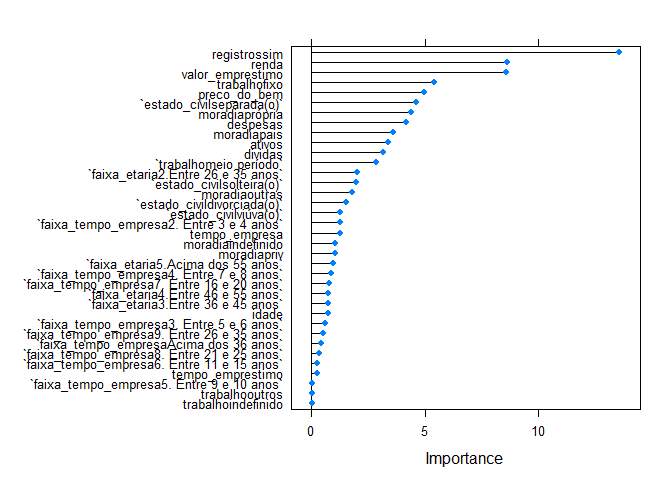

# Análise de Perfil: Concessão de Crédito

## Objetivo

  - Demonstrar algumas técnicas de AED;
  - Apresentar as caracteristicas demograficas e financeiras dos
    clientes presentes na base de dados;
  - Identificar quais variáveis do modelo explicam quais são os clientes
    bons e ruins;
  - Elaborar um modelo de previsão para o problema de negócio.

## Pacotes utilizados

``` r
library(tidyverse)
library(tidyr)
library(patchwork)
library(caret)
library(randomForest)
library(ROCR)
devtools::load_all()
```

**Etapa 1: Análise Exploratória dos Dados**

**Leitura do data.frame e visualização das variáveis**

``` r
df_credito <- read_rds("data/credito.rds")
glimpse(df_credito)
```

    ## Rows: 4,454
    ## Columns: 14
    ## $ status           <chr> "bom", "bom", "ruim", "bom", "bom", "bom", "bom", ...
    ## $ tempo_empresa    <int> 9, 17, 10, 0, 0, 1, 29, 9, 0, 0, 6, 7, 8, 19, 0, 0...
    ## $ moradia          <chr> "alugada", "alugada", "própria", "alugada", "aluga...
    ## $ tempo_emprestimo <int> 60, 60, 36, 60, 36, 60, 60, 12, 60, 48, 48, 36, 60...
    ## $ idade            <int> 30, 58, 46, 24, 26, 36, 44, 27, 32, 41, 34, 29, 30...
    ## $ estado_civil     <chr> "casada(o)", "viúva(o)", "casada(o)", "solteira(o)...
    ## $ registros        <chr> "não", "não", "sim", "não", "não", "não", "não", "...
    ## $ trabalho         <chr> "autônomo", "fixo", "autônomo", "fixo", "fixo", "f...
    ## $ despesas         <int> 73, 48, 90, 63, 46, 75, 75, 35, 90, 90, 60, 60, 75...
    ## $ renda            <int> 129, 131, 200, 182, 107, 214, 125, 80, 107, 80, 12...
    ## $ ativos           <int> 0, 0, 3000, 2500, 0, 3500, 10000, 0, 15000, 0, 400...
    ## $ dividas          <int> 0, 0, 0, 0, 0, 0, 0, 0, 0, 0, 0, 0, 2500, 260, 0, ...
    ## $ valor_emprestimo <int> 800, 1000, 2000, 900, 310, 650, 1600, 200, 1200, 1...
    ## $ preco_do_bem     <int> 846, 1658, 2985, 1325, 910, 1645, 1800, 1093, 1957...

**Contagem dos valores NAs por váriavel do modelo**

``` r
titulos_col <- df_credito %>%
  names

for(i in 1:length(titulos_col)){
 x <- contagem_nas(df_credito, titulos_col[i])[[1]]
  if(x>0){
   print(titulos_col[i])
   print(x)
  }

}
```

    ## [1] "moradia"
    ## [1] 26
    ## [1] "estado_civil"
    ## [1] 1
    ## [1] "trabalho"
    ## [1] 2
    ## [1] "renda"
    ## [1] 381
    ## [1] "ativos"
    ## [1] 47
    ## [1] "dividas"
    ## [1] 18

**Avaliação para substituição dos NA’s**

**As variáveis moradia, estado\_civil e trabalho, apresentaram um número
de NA’s pouco expressivo, foi considerado como ERRO no cadastro. Para
esse estudo não foi feita análise, mas sim a alteração dos campos NA’s
para “indefinido”.**

``` r
df_credito_ajustado <- df_credito%>%
  tidyr::replace_na(replace = list(moradia = "indefinido",
                                   estado_civil = "indefinido",
                                   trabalho = "indefinido"))
```

**As variáveis renda, ativos e dívidas, foram objeto de análise,
gráfica, conforme abaixo:**

``` r
grafico_rel_renda + grafico_rel_dividas + grafico_rel_ativos 
```

<!-- -->

**Retirada dos NA’s**

**A análise visual dos dados, nos mostra que ambas variáveis tem
distribuição próxima a média para o status, “Bom” ou “Ruim”.**

**Optei pela retirada dos NA’s e inclusão da média para variável.**

``` r
  df_credito_ajustado <- df_credito_ajustado %>%
  replace_na(replace = list(renda = mean(df_credito_ajustado$renda, na.rm = TRUE),
                            ativos = mean(df_credito_ajustado$ativos, na.rm = TRUE),
                            dividas = mean(df_credito_ajustado$dividas, na.rm = TRUE)))
```

**Etapa 2: Caracteristicas demograficas e financeiras dos clientes
presentes na base de dados.**

**Na etapa inicial, foi realizada analise gráfica e o mapeamento de
algumas variáveis, conforme abaixo:**

``` r
dist_por_perfil + grafico_estado_civil + dist_por_faixa_eta
```

<!-- -->

**Por fim uma análise dentro das variáveis analisadas, buscando a
proporcão de bons pagadores de forma ampla**

``` r
prop.faixa.et 
```

<!-- -->

``` r
prop.tempo.emp
```

<!-- -->

``` r
prop.est.civi 
```

<!-- -->

**Etapa 3: Elaborar modelo preditivo para o modelo**

**Ajustes nas Variáveis**

``` r
# Normalizando as variáveis

numeric.vars <- c("tempo_empresa", "tempo_emprestimo", "idade",
                  "despesas","renda","ativos","dividas", "valor_emprestimo","preco_do_bem")


df_credito_ajustado_previ <- scale.features(df_credito_ajustado_previ, numeric.vars)

#Variáveis tipo Fator
categorical.vars <- c('status_bin', 'faixa_tempo_empresa', 'faixa_etaria',
                      'estado_civil', 'trabalho', "moradia","registros")

df_credito_ajustado_previ <- to.factors(df = df_credito_ajustado_previ, variables = categorical.vars)


glimpse(df_credito_ajustado_previ)
```

    ## Rows: 4,453
    ## Columns: 16
    ## $ status_bin          <fct> 1, 1, 0, 1, 1, 1, 1, 1, 1, 0, 1, 1, 1, 1, 0, 1,...
    ## $ tempo_empresa       <dbl[,1]> <matrix[26 x 1]>
    ## $ faixa_tempo_empresa <fct> 5. Entre 9 e 10 anos, 7. Entre 16 e 20 anos, 5....
    ## $ moradia             <fct> alugada, alugada, própria, alugada, alugada, pr...
    ## $ tempo_emprestimo    <dbl[,1]> <matrix[26 x 1]>
    ## $ idade               <dbl[,1]> <matrix[26 x 1]>
    ## $ faixa_etaria        <fct> 2.Entre 26 e 35 anos, 5.Acima dos 55 anos, 4.En...
    ## $ estado_civil        <fct> casada(o), viúva(o), casada(o), solteira(o), so...
    ## $ registros           <fct> não, não, sim, não, não, não, não, não, não, nã...
    ## $ trabalho            <fct> autônomo, fixo, autônomo, fixo, fixo, fixo, fix...
    ## $ despesas            <dbl[,1]> <matrix[26 x 1]>
    ## $ renda               <dbl[,1]> <matrix[26 x 1]>
    ## $ ativos              <dbl[,1]> <matrix[26 x 1]>
    ## $ dividas             <dbl[,1]> <matrix[26 x 1]>
    ## $ valor_emprestimo    <dbl[,1]> <matrix[26 x 1]>
    ## $ preco_do_bem        <dbl[,1]> <matrix[26 x 1]>

**Divisão do data.frame em treino e teste**

``` r
# Dividindo os dados em treino e teste - 60:40
indexes <- sample(1:nrow(df_credito_ajustado_previ), size = 0.6 * nrow(df_credito_ajustado_previ))
train.data <- df_credito_ajustado_previ[indexes,]
test.data <- df_credito_ajustado_previ[-indexes,]
```

**Avaliando as variáveis que mais explicam o modelo**

``` r
rfe.results <- run.feature.selection(feature.vars = train.data[,-1],
                                 class.var = train.data[,1])

#Visualizando os resultados
rfe.results
```

    ## 
    ## Recursive feature selection
    ## 
    ## Outer resampling method: Cross-Validated (20 fold) 
    ## 
    ## Resampling performance over subset size:
    ## 
    ##  Variables Accuracy  Kappa AccuracySD KappaSD Selected
    ##          1   0.7413 0.2724    0.02569 0.07854         
    ##          2   0.7346 0.2526    0.02432 0.07024         
    ##          3   0.7477 0.2602    0.02826 0.08680         
    ##          4   0.7555 0.3280    0.03139 0.08937         
    ##          5   0.7495 0.3312    0.02716 0.07285         
    ##          6   0.7705 0.3848    0.02259 0.06434         
    ##          7   0.7709 0.3843    0.02672 0.07544         
    ##          8   0.7750 0.3903    0.02327 0.06807         
    ##          9   0.7817 0.4159    0.02654 0.07405         
    ##         10   0.7802 0.4101    0.02336 0.06912         
    ##         15   0.7929 0.4281    0.02391 0.07074        *
    ## 
    ## The top 5 variables (out of 15):
    ##    registros, renda, trabalho, valor_emprestimo, tempo_empresa

``` r
varImp((rfe.results))
```

    ##                       Overall
    ## registros           36.214502
    ## renda               20.559936
    ## trabalho            18.661862
    ## valor_emprestimo    18.295726
    ## tempo_empresa       14.791118
    ## ativos              14.215516
    ## faixa_tempo_empresa 11.396129
    ## moradia             10.986335
    ## preco_do_bem        10.881245
    ## tempo_emprestimo     7.140618
    ## idade                6.260294
    ## despesas             6.206391
    ## estado_civil         4.312657
    ## faixa_etaria         3.451281
    ## dividas             -1.465217

**As variáveis que apresentaram maior relação explicativa a relação bom
ou mau pagador (conforme esse modelo) são:**

**-registros**

**-trabalho**

**-tempo\_empresa**

**-renda**

**-valor-emprestimo**

**Na análise descritiva realizada no início do estudo foram avaliadas
faixa etária, tempo de trabalho na empresa e estado civil. Nota-se, que
somente o tempo de empresa dentre as variáveis, consta na lista das 5
mais explicativas.**

``` r
## Separando as variáveis
test.feature.vars <- test.data[,-1]
test.class.var <- test.data[,1]

# Construindo um modelo de regressão logística
formula.init <- "status_bin ~ ."
formula.init <- as.formula(formula.init)
lr.model <- glm(formula = formula.init, data = train.data, family = "binomial")

# Visualizando o modelo
summary(lr.model)
```

    ## 
    ## Call:
    ## glm(formula = formula.init, family = "binomial", data = train.data)
    ## 
    ## Deviance Residuals: 
    ##     Min       1Q   Median       3Q      Max  
    ## -3.1502  -0.5855   0.3812   0.6845   2.5799  
    ## 
    ## Coefficients:
    ##                                            Estimate Std. Error z value Pr(>|z|)
    ## (Intercept)                                0.924596   0.516493   1.790  0.07343
    ## tempo_empresa                              0.631001   0.462343   1.365  0.17232
    ## faixa_tempo_empresa2. Entre 3 e 4 anos     0.039409   0.208972   0.189  0.85042
    ## faixa_tempo_empresa3. Entre 5 e 6 anos     0.382212   0.309767   1.234  0.21725
    ## faixa_tempo_empresa4. Entre 7 e 8 anos     0.382042   0.430172   0.888  0.37448
    ## faixa_tempo_empresa5. Entre 9 e 10 anos    0.516267   0.541205   0.954  0.34012
    ## faixa_tempo_empresa6. Entre 11 e 15 anos  -0.003184   0.704324  -0.005  0.99639
    ## faixa_tempo_empresa7. Entre 16 e 20 anos   0.516700   1.010591   0.511  0.60915
    ## faixa_tempo_empresa8. Entre 21 e 25 anos   0.150932   1.304193   0.116  0.90787
    ## faixa_tempo_empresa9. Entre 26 e 35 anos  -0.786405   1.673310  -0.470  0.63838
    ## faixa_tempo_empresaAcima dos 36 anos      -2.014516   2.348857  -0.858  0.39108
    ## moradiaindefinido                         -0.739331   0.867108  -0.853  0.39386
    ## moradiaoutras                             -0.305404   0.208294  -1.466  0.14259
    ## moradiapais                                0.498779   0.177644   2.808  0.00499
    ## moradiapriv                               -0.104976   0.240182  -0.437  0.66206
    ## moradiaprópria                             0.658167   0.151478   4.345 1.39e-05
    ## tempo_emprestimo                           0.044030   0.065993   0.667  0.50465
    ## idade                                      0.155273   0.220769   0.703  0.48185
    ## faixa_etaria2.Entre 26 e 35 anos           0.103170   0.211329   0.488  0.62541
    ## faixa_etaria3.Entre 36 e 45 anos          -0.241949   0.372559  -0.649  0.51606
    ## faixa_etaria4.Entre 46 e 55 anos          -0.425723   0.567123  -0.751  0.45285
    ## faixa_etaria5.Acima dos 55 anos           -0.768484   0.763774  -1.006  0.31434
    ## estado_civildivorciada(o)                 -0.860563   0.547424  -1.572  0.11594
    ## estado_civilseparada(o)                   -0.937126   0.305117  -3.071  0.00213
    ## estado_civilsolteira(o)                   -0.332190   0.166509  -1.995  0.04604
    ## estado_civilviúva(o)                      -0.514229   0.447372  -1.149  0.25037
    ## registrossim                              -1.785327   0.131849 -13.541  < 2e-16
    ## trabalhofixo                               0.868247   0.134534   6.454 1.09e-10
    ## trabalhoindefinido                       -11.074940 324.743781  -0.034  0.97279
    ## trabalhomeio período                      -0.330051   0.193578  -1.705  0.08819
    ## trabalhooutros                             0.122790   0.274245   0.448  0.65434
    ## despesas                                  -0.287875   0.066997  -4.297 1.73e-05
    ## renda                                      0.577599   0.070178   8.230  < 2e-16
    ## ativos                                     0.496908   0.119821   4.147 3.37e-05
    ## dividas                                   -0.141455   0.061291  -2.308  0.02100
    ## valor_emprestimo                          -0.970323   0.110073  -8.815  < 2e-16
    ## preco_do_bem                               0.611508   0.106716   5.730 1.00e-08
    ##                                             
    ## (Intercept)                              .  
    ## tempo_empresa                               
    ## faixa_tempo_empresa2. Entre 3 e 4 anos      
    ## faixa_tempo_empresa3. Entre 5 e 6 anos      
    ## faixa_tempo_empresa4. Entre 7 e 8 anos      
    ## faixa_tempo_empresa5. Entre 9 e 10 anos     
    ## faixa_tempo_empresa6. Entre 11 e 15 anos    
    ## faixa_tempo_empresa7. Entre 16 e 20 anos    
    ## faixa_tempo_empresa8. Entre 21 e 25 anos    
    ## faixa_tempo_empresa9. Entre 26 e 35 anos    
    ## faixa_tempo_empresaAcima dos 36 anos        
    ## moradiaindefinido                           
    ## moradiaoutras                               
    ## moradiapais                              ** 
    ## moradiapriv                                 
    ## moradiaprópria                           ***
    ## tempo_emprestimo                            
    ## idade                                       
    ## faixa_etaria2.Entre 26 e 35 anos            
    ## faixa_etaria3.Entre 36 e 45 anos            
    ## faixa_etaria4.Entre 46 e 55 anos            
    ## faixa_etaria5.Acima dos 55 anos             
    ## estado_civildivorciada(o)                   
    ## estado_civilseparada(o)                  ** 
    ## estado_civilsolteira(o)                  *  
    ## estado_civilviúva(o)                        
    ## registrossim                             ***
    ## trabalhofixo                             ***
    ## trabalhoindefinido                          
    ## trabalhomeio período                     .  
    ## trabalhooutros                              
    ## despesas                                 ***
    ## renda                                    ***
    ## ativos                                   ***
    ## dividas                                  *  
    ## valor_emprestimo                         ***
    ## preco_do_bem                             ***
    ## ---
    ## Signif. codes:  0 '***' 0.001 '**' 0.01 '*' 0.05 '.' 0.1 ' ' 1
    ## 
    ## (Dispersion parameter for binomial family taken to be 1)
    ## 
    ##     Null deviance: 3171.6  on 2670  degrees of freedom
    ## Residual deviance: 2328.4  on 2634  degrees of freedom
    ## AIC: 2402.4
    ## 
    ## Number of Fisher Scoring iterations: 11

**Testando o modelo nos dados de teste e avaliando a ConfusionMatrix**

``` r
lr.predictions <- predict(lr.model, test.data, type="response")
lr.predictions <- round(lr.predictions)

confusionMatrix(table(data = lr.predictions, reference = test.class.var), positive = '1')
```

    ## Confusion Matrix and Statistics
    ## 
    ##     reference
    ## data    0    1
    ##    0  264  122
    ##    1  240 1156
    ##                                           
    ##                Accuracy : 0.7969          
    ##                  95% CI : (0.7774, 0.8153)
    ##     No Information Rate : 0.7172          
    ##     P-Value [Acc > NIR] : 7.390e-15       
    ##                                           
    ##                   Kappa : 0.461           
    ##                                           
    ##  Mcnemar's Test P-Value : 7.778e-10       
    ##                                           
    ##             Sensitivity : 0.9045          
    ##             Specificity : 0.5238          
    ##          Pos Pred Value : 0.8281          
    ##          Neg Pred Value : 0.6839          
    ##              Prevalence : 0.7172          
    ##          Detection Rate : 0.6487          
    ##    Detection Prevalence : 0.7834          
    ##       Balanced Accuracy : 0.7142          
    ##                                           
    ##        'Positive' Class : 1               
    ## 

**A matrix de confusao mostra que o modelo está acertando muito mais que
errando**

**Esse resultado está alinhado com o apurado para Accuracy**

**Em um primeiro momento poderiamos dizer o que o modelo está com um bom
nível de Accuracy, mas dá pra melhorar?**

``` r
#selecionar as melhores variáveis
formula <- "status_bin ~ ."
formula <- as.formula(formula)
control <- trainControl(method = "repeatedcv", number = 10, repeats = 2)
model <- train(formula, data = train.data, method = "glm", trControl = control)
```

    ## Warning in predict.lm(object, newdata, se.fit, scale = 1, type = if (type == :
    ## prediction from a rank-deficient fit may be misleading
    
    ## Warning in predict.lm(object, newdata, se.fit, scale = 1, type = if (type == :
    ## prediction from a rank-deficient fit may be misleading

``` r
importance <- varImp(model, scale = FALSE)
plot(importance)
```

<!-- -->
**Contrstuindo um novo modelo com variáveis selecionadas**

``` r
formula.new <- "status_bin ~ registros + valor_emprestimo + renda + trabalho + preco_do_bem + moradia + estado_civil + ativos + despesas + dividas + tempo_empresa"
formula.new <- as.formula(formula.new)
lr.model.new <- glm(formula = formula.new, data = train.data, family = "binomial")
glimpse(df_credito_ajustado_previ)
```

    ## Rows: 4,453
    ## Columns: 16
    ## $ status_bin          <fct> 1, 1, 0, 1, 1, 1, 1, 1, 1, 0, 1, 1, 1, 1, 0, 1,...
    ## $ tempo_empresa       <dbl[,1]> <matrix[26 x 1]>
    ## $ faixa_tempo_empresa <fct> 5. Entre 9 e 10 anos, 7. Entre 16 e 20 anos, 5....
    ## $ moradia             <fct> alugada, alugada, própria, alugada, alugada, pr...
    ## $ tempo_emprestimo    <dbl[,1]> <matrix[26 x 1]>
    ## $ idade               <dbl[,1]> <matrix[26 x 1]>
    ## $ faixa_etaria        <fct> 2.Entre 26 e 35 anos, 5.Acima dos 55 anos, 4.En...
    ## $ estado_civil        <fct> casada(o), viúva(o), casada(o), solteira(o), so...
    ## $ registros           <fct> não, não, sim, não, não, não, não, não, não, nã...
    ## $ trabalho            <fct> autônomo, fixo, autônomo, fixo, fixo, fixo, fix...
    ## $ despesas            <dbl[,1]> <matrix[26 x 1]>
    ## $ renda               <dbl[,1]> <matrix[26 x 1]>
    ## $ ativos              <dbl[,1]> <matrix[26 x 1]>
    ## $ dividas             <dbl[,1]> <matrix[26 x 1]>
    ## $ valor_emprestimo    <dbl[,1]> <matrix[26 x 1]>
    ## $ preco_do_bem        <dbl[,1]> <matrix[26 x 1]>

``` r
summary(lr.model.new)
```

    ## 
    ## Call:
    ## glm(formula = formula.new, family = "binomial", data = train.data)
    ## 
    ## Deviance Residuals: 
    ##     Min       1Q   Median       3Q      Max  
    ## -3.1182  -0.6173   0.3952   0.6921   2.4848  
    ## 
    ## Coefficients:
    ##                            Estimate Std. Error z value Pr(>|z|)    
    ## (Intercept)                 0.88666    0.16104   5.506 3.68e-08 ***
    ## registrossim               -1.77444    0.12988 -13.662  < 2e-16 ***
    ## valor_emprestimo           -0.92206    0.09453  -9.754  < 2e-16 ***
    ## renda                       0.55425    0.06893   8.041 8.90e-16 ***
    ## trabalhofixo                0.87603    0.13037   6.719 1.83e-11 ***
    ## trabalhoindefinido        -11.27941  324.74376  -0.035  0.97229    
    ## trabalhomeio período       -0.42082    0.18597  -2.263  0.02365 *  
    ## trabalhooutros             -0.01824    0.25617  -0.071  0.94324    
    ## preco_do_bem                0.59571    0.10216   5.831 5.51e-09 ***
    ## moradiaindefinido          -0.63411    0.84005  -0.755  0.45034    
    ## moradiaoutras              -0.29637    0.20557  -1.442  0.14939    
    ## moradiapais                 0.50969    0.17320   2.943  0.00325 ** 
    ## moradiapriv                -0.06996    0.23596  -0.296  0.76686    
    ## moradiaprópria              0.66028    0.14887   4.435 9.20e-06 ***
    ## estado_civildivorciada(o)  -0.79236    0.54369  -1.457  0.14501    
    ## estado_civilseparada(o)    -0.91688    0.29669  -3.090  0.00200 ** 
    ## estado_civilsolteira(o)    -0.36063    0.15607  -2.311  0.02085 *  
    ## estado_civilviúva(o)       -0.58865    0.43708  -1.347  0.17805    
    ## ativos                      0.44195    0.11231   3.935 8.31e-05 ***
    ## despesas                   -0.26717    0.06363  -4.199 2.68e-05 ***
    ## dividas                    -0.12207    0.05951  -2.051  0.04024 *  
    ## tempo_empresa               0.59519    0.07473   7.965 1.66e-15 ***
    ## ---
    ## Signif. codes:  0 '***' 0.001 '**' 0.01 '*' 0.05 '.' 0.1 ' ' 1
    ## 
    ## (Dispersion parameter for binomial family taken to be 1)
    ## 
    ##     Null deviance: 3171.6  on 2670  degrees of freedom
    ## Residual deviance: 2359.8  on 2649  degrees of freedom
    ## AIC: 2403.8
    ## 
    ## Number of Fisher Scoring iterations: 11

**Testando o modelo**

``` r
# Testando o modelo nos dados de teste
lr.predictions.new <- predict(lr.model.new, test.data, type = "response") 
lr.predictions.new <- round(lr.predictions.new)
```

**Avaliando a matrix de confusão e mudança na Accuracy**

``` r
confusionMatrix(table(data = lr.predictions.new, reference = test.class.var), positive = '1')
```

    ## Confusion Matrix and Statistics
    ## 
    ##     reference
    ## data    0    1
    ##    0  258  112
    ##    1  246 1166
    ##                                           
    ##                Accuracy : 0.7991          
    ##                  95% CI : (0.7797, 0.8175)
    ##     No Information Rate : 0.7172          
    ##     P-Value [Acc > NIR] : 1.230e-15       
    ##                                           
    ##                   Kappa : 0.4614          
    ##                                           
    ##  Mcnemar's Test P-Value : 2.076e-12       
    ##                                           
    ##             Sensitivity : 0.9124          
    ##             Specificity : 0.5119          
    ##          Pos Pred Value : 0.8258          
    ##          Neg Pred Value : 0.6973          
    ##              Prevalence : 0.7172          
    ##          Detection Rate : 0.6543          
    ##    Detection Prevalence : 0.7924          
    ##       Balanced Accuracy : 0.7121          
    ##                                           
    ##        'Positive' Class : 1               
    ## 

**Com base na Accuracy concluiu-se utilizar o segundo modelo, embora
seja pequena a mudança de um para o outro**

**Para concluir, foi apresentado a Curva de ROC no gráfico abaixo:**

``` r
# Criando curvas ROC
lr.model.best <- lr.model
lr.prediction.values <- predict(lr.model.best, test.feature.vars, type = "response")
predictions <- prediction(lr.prediction.values, test.class.var)
par(mfrow = c(1,2))
plot.roc.curve(predictions, title.text = "Curva ROC")
plot.pr.curve(predictions, title.text = "Curva Precision/Recall")
```

<!-- -->

**O gráfico da esquerda nos mostra que a curva toda acima e a esquerda
da reta. Sendo assim nosso modelo preditivo está estimando bem .**
