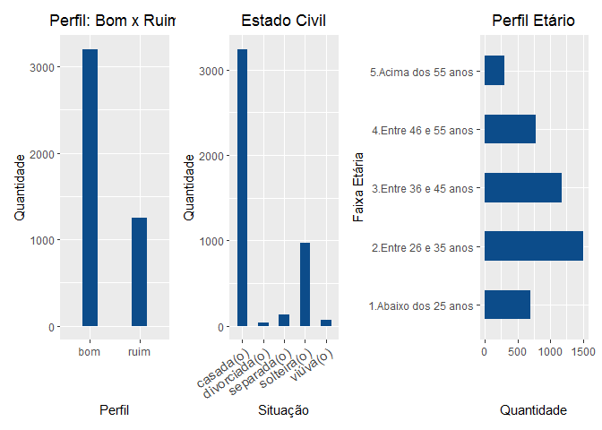

# Análise de Perfil: Concessão de Crédito

## Objetivo

  - Extrair informações da base fornecida;  
  - Apresentar as caracteristicas demograficas e financeiras dos
    clientes presentes na base de dados;
  - Identificar entre as variáveis do modelo, quais explicam um cliente
    ser bom ou ruim.
  - Elaborar um modelo de previsão para o problema de negócio.

## Pacotes utilizados

``` r
library(tidyverse)
library(tidyr)
library(patchwork)
library(caret)
library(randomForest)
library(ROCR)
devtools::load_all()
```

<font size="5">Etapa 1: Análise Exploratória dos Dados</font>

**Leitura do data.frame e visualização das variáveis**

``` r
df_credito <- read_rds("data/credito.rds")
glimpse(df_credito)
```

    ## Rows: 4,454
    ## Columns: 14
    ## $ status           <chr> "bom", "bom", "ruim", "bom", "bom", "bom", "bom", ...
    ## $ tempo_empresa    <int> 9, 17, 10, 0, 0, 1, 29, 9, 0, 0, 6, 7, 8, 19, 0, 0...
    ## $ moradia          <chr> "alugada", "alugada", "própria", "alugada", "aluga...
    ## $ tempo_emprestimo <int> 60, 60, 36, 60, 36, 60, 60, 12, 60, 48, 48, 36, 60...
    ## $ idade            <int> 30, 58, 46, 24, 26, 36, 44, 27, 32, 41, 34, 29, 30...
    ## $ estado_civil     <chr> "casada(o)", "viúva(o)", "casada(o)", "solteira(o)...
    ## $ registros        <chr> "não", "não", "sim", "não", "não", "não", "não", "...
    ## $ trabalho         <chr> "autônomo", "fixo", "autônomo", "fixo", "fixo", "f...
    ## $ despesas         <int> 73, 48, 90, 63, 46, 75, 75, 35, 90, 90, 60, 60, 75...
    ## $ renda            <int> 129, 131, 200, 182, 107, 214, 125, 80, 107, 80, 12...
    ## $ ativos           <int> 0, 0, 3000, 2500, 0, 3500, 10000, 0, 15000, 0, 400...
    ## $ dividas          <int> 0, 0, 0, 0, 0, 0, 0, 0, 0, 0, 0, 0, 2500, 260, 0, ...
    ## $ valor_emprestimo <int> 800, 1000, 2000, 900, 310, 650, 1600, 200, 1200, 1...
    ## $ preco_do_bem     <int> 846, 1658, 2985, 1325, 910, 1645, 1800, 1093, 1957...

**Identificar valores NA’s no modelo e formas tratalos**

``` r
titulos_col <- df_credito %>%
  names

for(i in 1:length(titulos_col)){
 x <- contagem_nas(df_credito, titulos_col[i])[[1]]
  if(x>0){
   print(titulos_col[i])
   print(x)
  }

}
```

    ## [1] "moradia"
    ## [1] 26
    ## [1] "estado_civil"
    ## [1] 1
    ## [1] "trabalho"
    ## [1] 2
    ## [1] "renda"
    ## [1] 381
    ## [1] "ativos"
    ## [1] 47
    ## [1] "dividas"
    ## [1] 18

<font size="4">O que fazer com os NA’s do modelo? Eles estão em
variáveis que explicam a variável alvo? São muitos os NA’s?</font>

**As variáveis moradia, estado\_civil e trabalho, apresentaram um número
de NA’s pouco expressivo (menos de 1% do número de obs.), a situação NA
foi considerada como ERRO no cadastro. Para esse estudo não foi feita
análise, mas sim a alteração dos campos NA’s para “indefinido”.**

``` r
df_credito_ajustado <- df_credito%>%
  tidyr::replace_na(replace = list(moradia = "indefinido",
                                   estado_civil = "indefinido",
                                   trabalho = "indefinido"))
```

**As variáveis renda, ativos e dívidas, foram objeto de análise,
gráfica, conforme abaixo:**

``` r
grafico_rel_renda + grafico_rel_dividas + grafico_rel_ativos 
```

<!-- -->

**Retirada dos NA’s**

**A análise visual dos dados, nos mostra que ambas variáveis tem
distribuição próxima a média para o status, “Bom” ou “Ruim”.**

**Optei pela retirada dos NA’s e inclusão da média para variável.**

``` r
  df_credito_ajustado <- df_credito_ajustado %>%
  replace_na(replace = list(renda = mean(df_credito_ajustado$renda, na.rm = TRUE),
                            ativos = mean(df_credito_ajustado$ativos, na.rm = TRUE),
                            dividas = mean(df_credito_ajustado$dividas, na.rm = TRUE)))
```

<font size="5">Etapa 2: Caracteristicas demograficas e financeiras dos
clientes presentes na base de dados.</font>

**Na etapa inicial, foi realizada analise gráfica e o mapeamento de
algumas variáveis, conforme abaixo:**

**Buscando compreender um pouco mais sobre quem foram meus clientes no
passado, montei gráficos para IDADE(por faixa etária), tempo de empresa
(também por faixas) e distribuição de bons e ruins clientes.**

``` r
df_credito_ajustado <- df_credito_ajustado %>%
  mutate(faixa_etaria = case_when(idade<=25 ~ "1.Abaixo dos 25 anos",
                                  idade<=35 ~ "2.Entre 26 e 35 anos",
                                  idade<=45 ~ "3.Entre 36 e 45 anos",
                                  idade<=55 ~ "4.Entre 46 e 55 anos",
                                  idade>55 ~"5.Acima dos 55 anos")) %>%
  relocate(faixa_etaria, .after = idade)

df_credito_ajustado <- df_credito_ajustado %>%
  mutate(faixa_tempo_empresa = case_when(tempo_empresa<=2 ~ "1. Abaixo dos 2 anos",
                                  tempo_empresa <= 4 ~ "2. Entre 3 e 4 anos",
                                  tempo_empresa <= 6 ~ "3. Entre 5 e 6 anos",
                                  tempo_empresa <= 8 ~ "4. Entre 7 e 8 anos",
                                  tempo_empresa <= 10 ~ "5. Entre 9 e 10 anos",
                                  tempo_empresa<=15 ~ "6. Entre 11 e 15 anos",
                                  tempo_empresa<=20 ~ "7. Entre 16 e 20 anos",
                                  tempo_empresa<=25 ~ "8. Entre 21 e 25 anos",
                                  tempo_empresa<=36 ~ "9. Entre 26 e 35 anos",
                                  tempo_empresa>36 ~"Acima dos 36 anos")) %>%
  relocate(faixa_tempo_empresa, .after = tempo_empresa)
```

``` r
dist_por_perfil + grafico_estado_civil + dist_por_faixa_eta
```

<!-- -->

**Por fim, quiz checar dentre essas variáveis qual a proporção entre os
clientes Bons e Ruins**

``` r
tab_faixa_tempoempre
```

    ## # A tibble: 10 x 4
    ## # Groups:   faixa_tempo_empresa [10]
    ##    faixa_tempo_empresa     bom  ruim prop.bons.ruins
    ##    <chr>                 <int> <int>           <dbl>
    ##  1 1. Abaixo dos 2 anos    815   684            1.19
    ##  2 2. Entre 3 e 4 anos     411   158            2.60
    ##  3 3. Entre 5 e 6 anos     332   115            2.89
    ##  4 4. Entre 7 e 8 anos     239    61            3.92
    ##  5 5. Entre 9 e 10 anos    250    65            3.85
    ##  6 6. Entre 11 e 15 anos   502   100            5.02
    ##  7 7. Entre 16 e 20 anos   338    35            9.66
    ##  8 8. Entre 21 e 25 anos   154    17            9.06
    ##  9 9. Entre 26 e 35 anos   128    17            7.53
    ## 10 Acima dos 36 anos        31     2           15.5

``` r
tab_faixa_etaria 
```

    ## # A tibble: 5 x 4
    ## # Groups:   faixa_etaria [5]
    ##   faixa_etaria           bom  ruim prop.bons.ruins
    ##   <chr>                <int> <int>           <dbl>
    ## 1 1.Abaixo dos 25 anos   442   260            1.7 
    ## 2 2.Entre 26 e 35 anos  1101   408            2.70
    ## 3 3.Entre 36 e 45 anos   813   362            2.25
    ## 4 4.Entre 46 e 55 anos   608   167            3.64
    ## 5 5.Acima dos 55 anos    236    57            4.14

``` r
prop.faixa.et 
```

<!-- -->

``` r
prop.tempo.emp
```

<!-- -->

``` r
prop.est.civi 
```

<!-- -->

<font size="5">3: Elaborar modelo preditivo para o modelo</font>

**Quando iniciei essa etapa a primeira coisa que percebi é que a
limpeza/tratamento que havia dado ao modelo no início do projeto não
eram suficientes para agora eu trabalhar com um modelo de regressão
logística. Então mais um poquinho de tratamento aos dados…**

``` r
# Normalizando as variáveis

numeric.vars <- c("tempo_empresa", "tempo_emprestimo", "idade",
                  "despesas","renda","ativos","dividas", "valor_emprestimo","preco_do_bem")


df_credito_ajustado_previ <- scale.features(df_credito_ajustado_previ, numeric.vars)

#Variáveis tipo Fator
categorical.vars <- c('status_bin', 'faixa_tempo_empresa', 'faixa_etaria',
                      'estado_civil', 'trabalho', "moradia","registros")

df_credito_ajustado_previ <- to.factors(df = df_credito_ajustado_previ, variables = categorical.vars)


glimpse(df_credito_ajustado_previ)
```

    ## Rows: 4,453
    ## Columns: 16
    ## $ status_bin          <fct> 1, 1, 0, 1, 1, 1, 1, 1, 1, 0, 1, 1, 1, 1, 0, 1,...
    ## $ tempo_empresa       <dbl[,1]> <matrix[26 x 1]>
    ## $ faixa_tempo_empresa <fct> 5. Entre 9 e 10 anos, 7. Entre 16 e 20 anos, 5....
    ## $ moradia             <fct> alugada, alugada, própria, alugada, alugada, pr...
    ## $ tempo_emprestimo    <dbl[,1]> <matrix[26 x 1]>
    ## $ idade               <dbl[,1]> <matrix[26 x 1]>
    ## $ faixa_etaria        <fct> 2.Entre 26 e 35 anos, 5.Acima dos 55 anos, 4.En...
    ## $ estado_civil        <fct> casada(o), viúva(o), casada(o), solteira(o), so...
    ## $ registros           <fct> não, não, sim, não, não, não, não, não, não, nã...
    ## $ trabalho            <fct> autônomo, fixo, autônomo, fixo, fixo, fixo, fix...
    ## $ despesas            <dbl[,1]> <matrix[26 x 1]>
    ## $ renda               <dbl[,1]> <matrix[26 x 1]>
    ## $ ativos              <dbl[,1]> <matrix[26 x 1]>
    ## $ dividas             <dbl[,1]> <matrix[26 x 1]>
    ## $ valor_emprestimo    <dbl[,1]> <matrix[26 x 1]>
    ## $ preco_do_bem        <dbl[,1]> <matrix[26 x 1]>

**Divisão do data.frame em treino e teste**

``` r
#60:40
indexes <- sample(1:nrow(df_credito_ajustado_previ), size = 0.6 * nrow(df_credito_ajustado_previ))
train.data <- df_credito_ajustado_previ[indexes,]
test.data <- df_credito_ajustado_previ[-indexes,]
```

**Avaliando as variáveis que mais explicam o modelo**

``` r
rfe.results <- run.feature.selection(feature.vars = train.data[,-1],
                                 class.var = train.data[,1])

#Visualizando os resultados
rfe.results
```

    ## 
    ## Recursive feature selection
    ## 
    ## Outer resampling method: Cross-Validated (10 fold) 
    ## 
    ## Resampling performance over subset size:
    ## 
    ##  Variables Accuracy  Kappa AccuracySD KappaSD Selected
    ##          1   0.7305 0.2457    0.02291 0.07045         
    ##          2   0.7334 0.2860    0.02195 0.08515         
    ##          3   0.7432 0.2657    0.01887 0.06184         
    ##          4   0.7391 0.2913    0.02440 0.07459         
    ##          5   0.7552 0.3592    0.03127 0.07919         
    ##          6   0.7784 0.4170    0.02004 0.05516         
    ##          7   0.7791 0.4109    0.02518 0.06571         
    ##          8   0.7795 0.4143    0.02222 0.05961         
    ##          9   0.7705 0.3998    0.02887 0.07561         
    ##         10   0.7754 0.4107    0.02648 0.07170         
    ##         15   0.7840 0.4250    0.02802 0.07328        *
    ## 
    ## The top 5 variables (out of 15):
    ##    registros, trabalho, renda, valor_emprestimo, tempo_empresa

``` r
varImp((rfe.results))
```

    ##                       Overall
    ## registros           27.836319
    ## trabalho            20.949837
    ## renda               19.250608
    ## valor_emprestimo    18.954040
    ## tempo_empresa       16.626896
    ## ativos              16.225891
    ## faixa_tempo_empresa 12.003006
    ## moradia             11.605430
    ## despesas             6.255907
    ## idade                5.792385
    ## preco_do_bem         5.476310
    ## tempo_emprestimo     5.246199
    ## faixa_etaria         3.336701
    ## estado_civil         3.197131
    ## dividas              3.066946

**As variáveis que apresentaram maior relação explicativa a relação bom
ou ruim pagador (conforme esse modelo) são:**

**-registros**

**-trabalho**

**-tempo\_empresa**

**-renda**

**-valor-emprestimo**

**Na análise descritiva realizada no início do estudo foram avaliadas
faixa etária, tempo de trabalho na empresa e estado civil. Nota-se, que
somente o tempo de empresa dentre as variáveis, consta na lista das 5
mais explicativas.**

**Isso reforça a ideia de que devemos trabalhar com dados**

**Nessa próxima etapa, construi o modelo inicial**

``` r
## Separando as variáveis
test.feature.vars <- test.data[,-1]
test.class.var <- test.data[,1]

# Construindo um modelo de regressão logística
formula.init <- "status_bin ~ ."
formula.init <- as.formula(formula.init)
lr.model <- glm(formula = formula.init, data = train.data, family = "binomial")

# Visualizando o modelo
summary(lr.model)
```

    ## 
    ## Call:
    ## glm(formula = formula.init, family = "binomial", data = train.data)
    ## 
    ## Deviance Residuals: 
    ##     Min       1Q   Median       3Q      Max  
    ## -3.2029  -0.6079   0.3747   0.6795   2.4043  
    ## 
    ## Coefficients:
    ##                                            Estimate Std. Error z value Pr(>|z|)
    ## (Intercept)                                0.634186   0.510432   1.242 0.214070
    ## tempo_empresa                              0.601862   0.462706   1.301 0.193346
    ## faixa_tempo_empresa2. Entre 3 e 4 anos     0.335512   0.212756   1.577 0.114800
    ## faixa_tempo_empresa3. Entre 5 e 6 anos     0.510295   0.310483   1.644 0.100268
    ## faixa_tempo_empresa4. Entre 7 e 8 anos     0.583685   0.430673   1.355 0.175327
    ## faixa_tempo_empresa5. Entre 9 e 10 anos    0.349786   0.543054   0.644 0.519505
    ## faixa_tempo_empresa6. Entre 11 e 15 anos   0.423644   0.711325   0.596 0.551462
    ## faixa_tempo_empresa7. Entre 16 e 20 anos   0.597617   1.018475   0.587 0.557354
    ## faixa_tempo_empresa8. Entre 21 e 25 anos   0.437473   1.309076   0.334 0.738240
    ## faixa_tempo_empresa9. Entre 26 e 35 anos  -0.409444   1.712006  -0.239 0.810981
    ## faixa_tempo_empresaAcima dos 36 anos      -1.657397   2.351802  -0.705 0.480975
    ## moradiaindefinido                         -0.618758   0.632479  -0.978 0.327923
    ## moradiaoutras                             -0.174440   0.212107  -0.822 0.410842
    ## moradiapais                                0.551360   0.173460   3.179 0.001480
    ## moradiapriv                               -0.305118   0.226774  -1.345 0.178472
    ## moradiaprópria                             0.667261   0.150796   4.425 9.65e-06
    ## tempo_emprestimo                          -0.002625   0.067068  -0.039 0.968780
    ## idade                                     -0.003837   0.221226  -0.017 0.986162
    ## faixa_etaria2.Entre 26 e 35 anos           0.201230   0.214706   0.937 0.348638
    ## faixa_etaria3.Entre 36 e 45 anos          -0.111561   0.374493  -0.298 0.765780
    ## faixa_etaria4.Entre 46 e 55 anos          -0.185408   0.566945  -0.327 0.743646
    ## faixa_etaria5.Acima dos 55 anos           -0.146724   0.791008  -0.185 0.852845
    ## estado_civildivorciada(o)                 -0.856001   0.540737  -1.583 0.113415
    ## estado_civilseparada(o)                   -1.153405   0.322465  -3.577 0.000348
    ## estado_civilsolteira(o)                   -0.195953   0.166632  -1.176 0.239610
    ## estado_civilviúva(o)                      -0.473446   0.424394  -1.116 0.264602
    ## registrossim                              -1.659237   0.135513 -12.244  < 2e-16
    ## trabalhofixo                               0.857375   0.132302   6.480 9.15e-11
    ## trabalhoindefinido                       -12.331523 378.440674  -0.033 0.974005
    ## trabalhomeio período                      -0.495733   0.186022  -2.665 0.007701
    ## trabalhooutros                             0.074370   0.270122   0.275 0.783071
    ## despesas                                  -0.227723   0.066402  -3.429 0.000605
    ## renda                                      0.543113   0.071953   7.548 4.42e-14
    ## ativos                                     0.534566   0.125374   4.264 2.01e-05
    ## dividas                                   -0.190742   0.065153  -2.928 0.003416
    ## valor_emprestimo                          -0.913801   0.107196  -8.525  < 2e-16
    ## preco_do_bem                               0.525377   0.105891   4.961 7.00e-07
    ##                                             
    ## (Intercept)                                 
    ## tempo_empresa                               
    ## faixa_tempo_empresa2. Entre 3 e 4 anos      
    ## faixa_tempo_empresa3. Entre 5 e 6 anos      
    ## faixa_tempo_empresa4. Entre 7 e 8 anos      
    ## faixa_tempo_empresa5. Entre 9 e 10 anos     
    ## faixa_tempo_empresa6. Entre 11 e 15 anos    
    ## faixa_tempo_empresa7. Entre 16 e 20 anos    
    ## faixa_tempo_empresa8. Entre 21 e 25 anos    
    ## faixa_tempo_empresa9. Entre 26 e 35 anos    
    ## faixa_tempo_empresaAcima dos 36 anos        
    ## moradiaindefinido                           
    ## moradiaoutras                               
    ## moradiapais                              ** 
    ## moradiapriv                                 
    ## moradiaprópria                           ***
    ## tempo_emprestimo                            
    ## idade                                       
    ## faixa_etaria2.Entre 26 e 35 anos            
    ## faixa_etaria3.Entre 36 e 45 anos            
    ## faixa_etaria4.Entre 46 e 55 anos            
    ## faixa_etaria5.Acima dos 55 anos             
    ## estado_civildivorciada(o)                   
    ## estado_civilseparada(o)                  ***
    ## estado_civilsolteira(o)                     
    ## estado_civilviúva(o)                        
    ## registrossim                             ***
    ## trabalhofixo                             ***
    ## trabalhoindefinido                          
    ## trabalhomeio período                     ** 
    ## trabalhooutros                              
    ## despesas                                 ***
    ## renda                                    ***
    ## ativos                                   ***
    ## dividas                                  ** 
    ## valor_emprestimo                         ***
    ## preco_do_bem                             ***
    ## ---
    ## Signif. codes:  0 '***' 0.001 '**' 0.01 '*' 0.05 '.' 0.1 ' ' 1
    ## 
    ## (Dispersion parameter for binomial family taken to be 1)
    ## 
    ##     Null deviance: 3199.4  on 2670  degrees of freedom
    ## Residual deviance: 2316.3  on 2634  degrees of freedom
    ## AIC: 2390.3
    ## 
    ## Number of Fisher Scoring iterations: 12

**Testando o modelo nos dados inicial e avaliando a ConfusionMatrix**

``` r
lr.predictions <- predict(lr.model, test.data, type="response")
lr.predictions <- round(lr.predictions)

confusionMatrix(table(data = lr.predictions, reference = test.class.var), positive = '1')
```

    ## Confusion Matrix and Statistics
    ## 
    ##     reference
    ## data    0    1
    ##    0  234  105
    ##    1  255 1188
    ##                                           
    ##                Accuracy : 0.798           
    ##                  95% CI : (0.7786, 0.8164)
    ##     No Information Rate : 0.7256          
    ##     P-Value [Acc > NIR] : 9.955e-13       
    ##                                           
    ##                   Kappa : 0.4392          
    ##                                           
    ##  Mcnemar's Test P-Value : 4.062e-15       
    ##                                           
    ##             Sensitivity : 0.9188          
    ##             Specificity : 0.4785          
    ##          Pos Pred Value : 0.8233          
    ##          Neg Pred Value : 0.6903          
    ##              Prevalence : 0.7256          
    ##          Detection Rate : 0.6667          
    ##    Detection Prevalence : 0.8098          
    ##       Balanced Accuracy : 0.6987          
    ##                                           
    ##        'Positive' Class : 1               
    ## 

**A matrix de confusao mostra que o modelo está acertando muito mais que
errando**

**Esse resultado está alinhado com o apurado para Accuracy, que é
relativamente alto**

<font size="3">Em um primeiro momento poderiamos dizer o que o modelo
está com um bom nível de Accuracy, mas dá pra melhorar?</font>

``` r
#selecionar as melhores variáveis
formula <- "status_bin ~ ."
formula <- as.formula(formula)
control <- trainControl(method = "repeatedcv", number = 10, repeats = 2)
model <- train(formula, data = train.data, method = "glm", trControl = control)
importance <- varImp(model, scale = FALSE)
plot(importance)
```

<!-- -->
**Contrstuindo um novo modelo com variáveis selecionadas**

``` r
formula.new <- "status_bin ~ registros + valor_emprestimo + renda + trabalho + preco_do_bem + moradia + estado_civil + ativos + despesas + dividas + tempo_empresa"
formula.new <- as.formula(formula.new)
lr.model.new <- glm(formula = formula.new, data = train.data, family = "binomial")
glimpse(df_credito_ajustado_previ)
```

    ## Rows: 4,453
    ## Columns: 16
    ## $ status_bin          <fct> 1, 1, 0, 1, 1, 1, 1, 1, 1, 0, 1, 1, 1, 1, 0, 1,...
    ## $ tempo_empresa       <dbl[,1]> <matrix[26 x 1]>
    ## $ faixa_tempo_empresa <fct> 5. Entre 9 e 10 anos, 7. Entre 16 e 20 anos, 5....
    ## $ moradia             <fct> alugada, alugada, própria, alugada, alugada, pr...
    ## $ tempo_emprestimo    <dbl[,1]> <matrix[26 x 1]>
    ## $ idade               <dbl[,1]> <matrix[26 x 1]>
    ## $ faixa_etaria        <fct> 2.Entre 26 e 35 anos, 5.Acima dos 55 anos, 4.En...
    ## $ estado_civil        <fct> casada(o), viúva(o), casada(o), solteira(o), so...
    ## $ registros           <fct> não, não, sim, não, não, não, não, não, não, nã...
    ## $ trabalho            <fct> autônomo, fixo, autônomo, fixo, fixo, fixo, fix...
    ## $ despesas            <dbl[,1]> <matrix[26 x 1]>
    ## $ renda               <dbl[,1]> <matrix[26 x 1]>
    ## $ ativos              <dbl[,1]> <matrix[26 x 1]>
    ## $ dividas             <dbl[,1]> <matrix[26 x 1]>
    ## $ valor_emprestimo    <dbl[,1]> <matrix[26 x 1]>
    ## $ preco_do_bem        <dbl[,1]> <matrix[26 x 1]>

``` r
summary(lr.model.new)
```

    ## 
    ## Call:
    ## glm(formula = formula.new, family = "binomial", data = train.data)
    ## 
    ## Deviance Residuals: 
    ##     Min       1Q   Median       3Q      Max  
    ## -3.1639  -0.6401   0.3895   0.6976   2.4126  
    ## 
    ## Coefficients:
    ##                            Estimate Std. Error z value Pr(>|z|)    
    ## (Intercept)                 0.91143    0.15536   5.866 4.45e-09 ***
    ## registrossim               -1.64857    0.13331 -12.367  < 2e-16 ***
    ## valor_emprestimo           -0.92612    0.09254 -10.008  < 2e-16 ***
    ## renda                       0.53979    0.07145   7.555 4.19e-14 ***
    ## trabalhofixo                0.87322    0.12895   6.772 1.27e-11 ***
    ## trabalhoindefinido        -12.59782  377.95059  -0.033 0.973410    
    ## trabalhomeio período       -0.60451    0.17954  -3.367 0.000760 ***
    ## trabalhooutros             -0.08661    0.24612  -0.352 0.724915    
    ## preco_do_bem                0.53935    0.10091   5.345 9.04e-08 ***
    ## moradiaindefinido          -0.62524    0.61326  -1.020 0.307948    
    ## moradiaoutras              -0.22968    0.20911  -1.098 0.272044    
    ## moradiapais                 0.56638    0.17039   3.324 0.000887 ***
    ## moradiapriv                -0.26266    0.22320  -1.177 0.239267    
    ## moradiaprópria              0.65173    0.14803   4.403 1.07e-05 ***
    ## estado_civildivorciada(o)  -0.88442    0.53491  -1.653 0.098251 .  
    ## estado_civilseparada(o)    -1.14032    0.31421  -3.629 0.000284 ***
    ## estado_civilsolteira(o)    -0.21002    0.15602  -1.346 0.178275    
    ## estado_civilviúva(o)       -0.52979    0.41934  -1.263 0.206455    
    ## ativos                      0.48364    0.11886   4.069 4.73e-05 ***
    ## despesas                   -0.24239    0.06364  -3.809 0.000140 ***
    ## dividas                    -0.16406    0.06368  -2.576 0.009982 ** 
    ## tempo_empresa               0.68137    0.07660   8.895  < 2e-16 ***
    ## ---
    ## Signif. codes:  0 '***' 0.001 '**' 0.01 '*' 0.05 '.' 0.1 ' ' 1
    ## 
    ## (Dispersion parameter for binomial family taken to be 1)
    ## 
    ##     Null deviance: 3199.4  on 2670  degrees of freedom
    ## Residual deviance: 2345.0  on 2649  degrees of freedom
    ## AIC: 2389
    ## 
    ## Number of Fisher Scoring iterations: 12

**Testando o modelo**

``` r
# Testando o modelo nos dados de teste
lr.predictions.new <- predict(lr.model.new, test.data, type = "response") 
lr.predictions.new <- round(lr.predictions.new)
```

**Avaliando a matrix de confusão e mudança na Accuracy**

``` r
confusionMatrix(table(data = lr.predictions.new, reference = test.class.var), positive = '1')
```

    ## Confusion Matrix and Statistics
    ## 
    ##     reference
    ## data    0    1
    ##    0  232   98
    ##    1  257 1195
    ##                                           
    ##                Accuracy : 0.8008          
    ##                  95% CI : (0.7815, 0.8191)
    ##     No Information Rate : 0.7256          
    ##     P-Value [Acc > NIR] : 1.246e-13       
    ##                                           
    ##                   Kappa : 0.4435          
    ##                                           
    ##  Mcnemar's Test P-Value : < 2.2e-16       
    ##                                           
    ##             Sensitivity : 0.9242          
    ##             Specificity : 0.4744          
    ##          Pos Pred Value : 0.8230          
    ##          Neg Pred Value : 0.7030          
    ##              Prevalence : 0.7256          
    ##          Detection Rate : 0.6706          
    ##    Detection Prevalence : 0.8148          
    ##       Balanced Accuracy : 0.6993          
    ##                                           
    ##        'Positive' Class : 1               
    ## 

**Com base na Accuracy conclui que devemos utilizar o segundo modelo,
embora seja pequena a mudança de um para o outro**

**Para concluir, foi apresentado a Curva de ROC no gráfico abaixo:**

``` r
# Criando curvas ROC
lr.model.best <- lr.model
lr.prediction.values <- predict(lr.model.best, test.feature.vars, type = "response")
predictions <- prediction(lr.prediction.values, test.class.var)
par(mfrow = c(1,2))
plot.roc.curve(predictions, title.text = "Curva ROC")
plot.pr.curve(predictions, title.text = "Curva Precision/Recall")
```

<!-- -->

**O gráfico da esquerda nos mostra que a curva toda acima e a esquerda
da reta. Sendo assim nosso modelo preditivo está estimando bem .**
